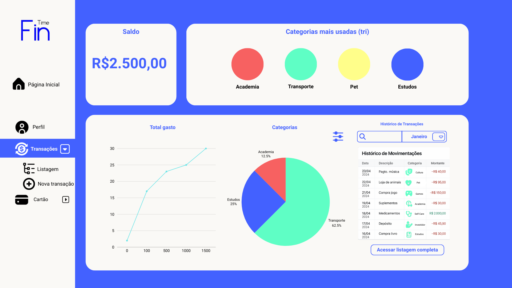

# Projeto de Interface

A plataforma foi desenvolvida com foco na facilidade de navegação, visualização intuitiva e segurança, buscando atender os requisitos funcionais, não funcionais e histórias de usuário mapeadas no projeto.

## User Flow

## Wireframes

Nesta etapa, foi feita a construção das telas que o sistema irá trabalhar, tratando todas as questões dos requisitos informado.

  
**Relacionados:** RF-001  
**Descrição:** Funcionalidade de cadastro e login.

  
**Relacionados:** RF-001  
**Descrição:** Funcionalidade de cadastro e login.

  
**Relacionados:** RF-002  
**Descrição:** Gráficos circulares segmentados para análise de gasto.

  
**Relacionados:** RF-004, RF-006 
**Descrição (RF-004):** Relatórios devem apresentar gráficos e informações corretas.  
**Descrição (RF-006):** Os relatórios mensais devem conter gastos totais, gastos por categoria e portifólio de investimento.

  
**Relacionados:**  RF-003, RF-005
**Descrição (RF-003):** Exportação de dados financeiros como CSV.  
**Descrição:(RF-005)** Funcionalidade de ordenação e filtragem de dados por categoria para otimização da visualização.

  
**Relacionados:** RF-007, RF-008  
**Descrição (RF-007):** Funcionalidade de inserção, remoção e edição de entradas e saídas financeiras do usuário.  
**Descrição (RF-008):** Registro de gastos futuros recorrentes ou não recorrentes para orçamentos.

  
**Relacionados:** RF-007
**Descrição (RF-007):** Funcionalidade de inserção, remoção e edição de entradas e saídas financeiras do usuário.

  
**Relacionados:** RF-007  
**Descrição:** Funcionalidade de inserção, remoção e edição de entradas e saídas financeiras do usuário.

  
**Relacionados:** RF-008
**Descrição:** Atribuir selos como recompensa com base nos dados do usuário.

