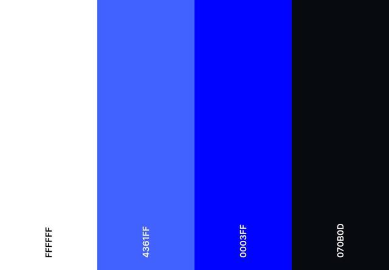

# Template padrão do site

Layout padrão do site (HTML e CSS) que será utilizado em todas as páginas com a definição de identidade visual, aspectos de responsividade e iconografia.

Explique as guias de estilo utilizadas no seu projeto.

## Design

Detalhe os layouts que serão utilizados. Apresente onde será colocado o logo do sistema. Defina os menus padrões, entre outras coisas.

## Cores

A identidade visual do projeto utiliza, como base, a combinação de azul ciano e branco. Essas cores foram cuidadosamente escolhidas por transmitirem sensações de segurança, confiança e tranquilidade, aspectos essenciais para aplicações voltadas ao controle financeiro pessoal.

A escolha dessa paleta foi inspirada em soluções consolidadas do mercado financeiro, como VISA e American Express, marcas que também adotam tons de azul para reforçar a ideia de solidez, credibilidade e estabilidade emocional. O azul, além de ser associado à responsabilidade e organização, ajuda a criar uma experiência visual leve e profissional, enquanto o branco proporciona clareza, limpeza e foco nos conteúdos.
 

## Tipografia

A tipografia utilizada no projeto é a Roboto, escolhida por ser uma fonte moderna e altamente legível em ambientes digitais. Sua versatilidade e boa leitura em diferentes tamanhos de tela tornam-na ideal para aplicações de gestão financeira, onde clareza e organização são essenciais.

### Funções e Aplicações

| Função                    | Tamanho | Peso    | Uso                                                             |
|:--------------------------|:--------|:---------|:----------------------------------------------------------------|
| **Título de Página**        | 19px    | Bold     | Exibir o nome da página ou seção principal de forma destacada.   |
| **Título de Seção**         | 14px    | Bold     | Identificar áreas ou categorias dentro das páginas.              |
| **Rótulos de Componentes**  | 12px    | Medium   | Exibir nomes de botões, campos, menus e legendas de gráficos.    |
| **Corpo de Texto**          | 10px    | Regular  | Utilizado para informações descritivas, explicações e conteúdos. |

## Iconografia

Defina os ícones que serão utilizados e suas respectivas funções.

Apresente os estilos CSS criados para cada um dos elementos apresentados.
Outras seções podem ser adicionadas neste documento para apresentar padrões de componentes, de menus, etc.

> **Links Úteis**:
>
> -  [Como criar um guia de estilo de design da Web](https://edrodrigues.com.br/blog/como-criar-um-guia-de-estilo-de-design-da-web/#)
> - [CSS Website Layout (W3Schools)](https://www.w3schools.com/css/css_website_layout.asp)
> - [Website Page Layouts](http://www.cellbiol.com/bioinformatics_web_development/chapter-3-your-first-web-page-learning-html-and-css/website-page-layouts/)
> - [Perfect Liquid Layout](https://matthewjamestaylor.com/perfect-liquid-layouts)
> - [How and Why Icons Improve Your Web Design](https://usabilla.com/blog/how-and-why-icons-improve-you-web-design/)
