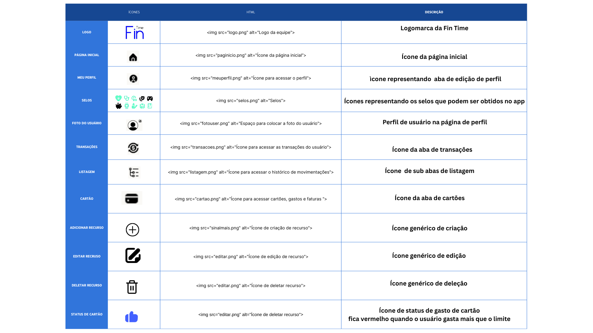

# Template padrão do site

## Design

O background é azul escuro #4361ff

O design consiste em um card branco, usado como principal componente sobre o fundo azul das telas

A sidebar, que contém os botões que mapeia para as telas, tem a função de uma barra de navegação e fica da cor do background quando o usuário entra em alguma, sempre está presente em todas as telas.

A logo fica na parte superior esquerda da sidebar, portanto, também está presente em todas as telas

## Cores

A identidade visual do projeto utiliza, como base, a combinação de azul ciano e branco. Essas cores foram cuidadosamente escolhidas por transmitirem sensações de segurança, confiança e tranquilidade, aspectos essenciais para aplicações voltadas ao controle financeiro pessoal.

A escolha dessa paleta foi inspirada em soluções consolidadas do mercado financeiro, como VISA e American Express, marcas que também adotam tons de azul para reforçar a ideia de solidez, credibilidade e estabilidade emocional. O azul, além de ser associado à responsabilidade e organização, ajuda a criar uma experiência visual leve e profissional, enquanto o branco proporciona clareza, limpeza e foco nos conteúdos.
 

## Tipografia

A tipografia utilizada no projeto é a Roboto, escolhida por ser uma fonte moderna e altamente legível em ambientes digitais. Sua versatilidade e boa leitura em diferentes tamanhos de tela tornam-na ideal para aplicações de gestão financeira, onde clareza e organização são essenciais.

### Funções e Aplicações

| Função                    | Tamanho | Peso    | Uso                                                             |
|:--------------------------|:--------|:---------|:----------------------------------------------------------------|
| **Título de Página**        | 19px    | Bold     | Exibir o nome da página ou seção principal de forma destacada.   |
| **Título de Seção**         | 14px    | Bold     | Identificar áreas ou categorias dentro das páginas.              |
| **Rótulos de Componentes**  | 12px    | Medium   | Exibir nomes de botões, campos, menus e legendas de gráficos.    |
| **Corpo de Texto**          | 10px    | Regular  | Utilizado para informações descritivas, explicações e conteúdos. |

## Iconografia

